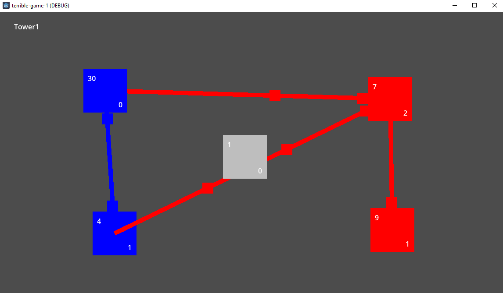

# Terrible Game 1

Inspired by some advertizement. Guaranteed fun for seconds.

You are blue, the opponent is red. Red is evil and they like all the things you don't. Destroy them at all cost! Grey is lazy and doesn't do anything, take their squares too.

Number in square's top left is level, bottom right is current troop lines (number of connections to other squares). Level determines maximum troop lines.

- Level 1 = one troop line
- Level 10 = two troop lines
- Level 20 = three troop lines

Click one of your squares to select it, then click a second square to send troops. Sending troops to one of your squares raises the level. Sending troops to someone elses square lowers their level.

Right click on a square to dismiss all troop sending (even enemies because bug!).

Once you control the five squares you become ruler of the universe and should tell all your friends. If red controls all squares, hang your head in shame [while you watch this video](https://www.youtube.com/watch?v=oabcM9SOF-E).

